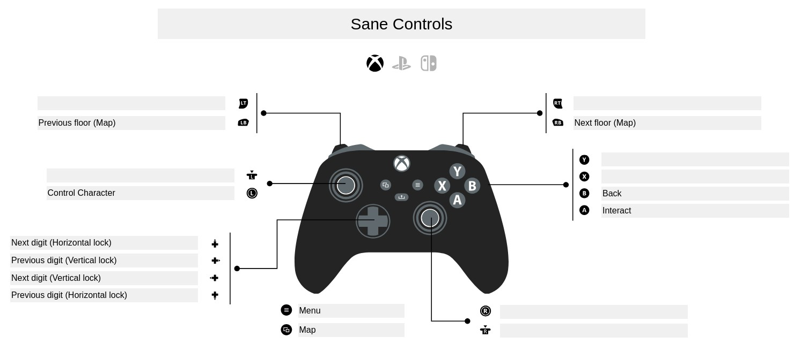
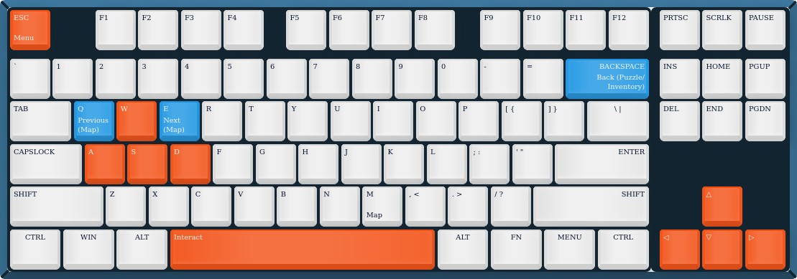

# Lorelei and the Sane Controls

https://github.com/user-attachments/assets/bec9f586-393c-4a85-9cc8-683cff3b5dce

This is a small mod for [Lorelei and the Laser Eyes](https://store.steampowered.com/app/2008920/Lorelei_and_the_Laser_Eyes/) that aims to somewhat improve the experience of navigating the numerous puzzles of The Letztes Jahr Hotel.

More specifically, it makes the following changes:
1. For simple (and most common) locks - padlocks, roman numeral locks, etc - the up 
and down button rotate the dials, and the "interact" button confirms the decision
2. It adds a new "Back" button (`B` on controllers and `Backspace` on keyboard) which lets you back out of puzzles and inventory screen
3. It adds a new "Map" button (`Select` on controllers and `M` on keyboard), which shows a map of the current floor (provided you have unlocked it in-game). Use `LB/RB` or `Q/E` to switch between floors. The shortcut also works in the maze and in the forest.

I didn't touch some of the more difficult locks (like the Red Maze Door), but most of my own gripes with the controls are solved now.
The Back button works in _most_ places, but not _everywhere_ (e.g. multiple choice dialog and free text input forms). Adding support for it involved a lot of ugly hacks and I've covered the most common/annoying screens.

# Mapping

# How to install

## On Windows

Download the zip archive from [Releases](https://github.com/graynk/LoreleiAndSaneControls/releases) page and extract it to the game's root directory (in Steam it's Right Mouse Button - Manage - Browse local files). Overwrite the `globalgamemanagers.assets` when prompted. Done!

## On Steam Deck

The mod uses [BepInEx](https://docs.bepinex.dev/index.html) to inject the custom code, which in turn [relies](https://docs.bepinex.dev/articles/advanced/proton_wine.html) on `winhttp.dll` proxy DLL.
That means you have to do additional steps

1. Switch to Desktop Mode
2. Download the zip archive from Releases page and extract it to the game's root directory
3. Install protontricks via Discover app and launch it
4. Choose Lorelei and the Laser Eyes
5. Select the default wine prefix
6. Run winecfg
7. In the Libraries tab add a new override for `winhttp.dll` and click OK

# How to build it yourself

## Library

1. Install [.NET SDK](https://dotnet.microsoft.com/en-us/download)
2. Clone this repo
3. Create a `lib` directory in the project
4. Copy `Assembly-CSharp.dll` from `path\to\game\Lorelei and the Laser Eyes_Data\Managed` to `lib`
5. Run `dotnet build --configuration Release`
6. Copy resulting DLL from `LoreleiAndSaneControls\bin\Release\net46\` to `path\to\game\BepInEx\plugins`
7. Copy `binds\globalgamemanagers.assets` to `path\to\game\Lorelei and the Laser Eyes_Data` OR follow the instruction to [import custom bindings](#custom-bindings) yourself 

## Custom bindings

1. Install [UABEA](https://github.com/nesrak1/UABEA)
2. Open `path\to\game\Lorelei and the Laser Eyes_Data\globalgamemanagers.assets` in the app
3. Find `InputManager` asset of type `MonoBehaviour` (NOT `MonoScript`)
4. Press `Import dump`, switch type from .txt to .json and select `InputManager-globalgamemanagers.assets-1624.json`
5. Save

# How to uninstall

1. Delete `BepInEx` folder and `winhttp.dll` from the game's root directory.
2. Verify the game's contents in Steam to restore original bindings

# Known problems

* The Map shortcut shows the map of the Hotel inside the Laser-1 prototypes and during the final sequence of the game, although it probably shouldn't. Not critical, not going to spend much time looking into it
* The Back button doesn't close the map screen opened by the Map shortcut. I've spent a _lot_ of time tracking this, and still couldn't figure out why it wasn't working - but you can still close it with the regular Interact button
